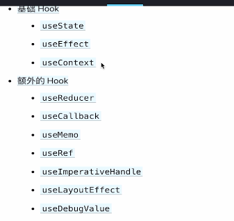

## hook的规则
1. 只在最顶层使用hook，不要在循环、条件、嵌套中使用hook。确保hook在每次渲染中都保持相同的顺序被调用
2. 只在React函数中调用hook
3. 除了我们学习的hook，还有什么其他的hook
    
  useReducer 为了简化复杂的useState, 有了这个, 后面可以不使用redux了
  useCallback 为了性能调优，为了在多次渲染中记住某个函数

  有一个网站叫useHook, 里面是别人写的hook

## react18更新内容
### 新的理念
- concurrent：并发性，它不是一个新的特性，而是React内部衍生出来的一种新的工作机制
  并发性是指具备处理多个任务的能力，并不是同时可以处理多个，而是有可能交替进行处理，按照优先级，
  每次处理一个任务  
  为什么react要支持并发？  
  两次setState，必须要等待第一次setState执行完成之后，才能执行下次的setState。使用调度器，负责回调优先排序和调用。有了这个可以使用trasitionApi 可以标注setState的优先级   

  react18使用了一个调度器，会将事件和功能进行组合重新排序以及优先处理，以便给我们用户最佳的高性能体验
### 新的特性
- 新的渲染API： createRoot
- 自动批处理：Automatic Batching
  更新合并，react17中更新会更新多次，react18中会被合并为一次。当然也可以手动去停止自动批处理
- 过渡API: Transitions
- Suspense API
  1. 动态加载组件
  2. 等待异步数据加载
  

ReactDOM.render 在react18中不被支持，需要使用createRoot替代

